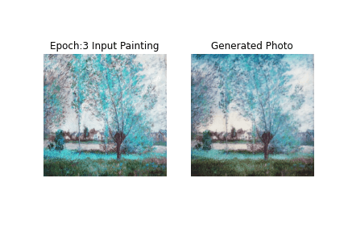

# SCC0233 - Machine Learning And Data Mining Applications

|  | |
|-|-|

## Group members

- Vinícius Torres Dutra Maia da Costa - 10262781
- Caio Abreu de Oliveira Ribeiro - 10262839
- Alexandre Norcia Medeiros - 10295583
- Gabriel Alfonso Nascimento Salgueiro -10284368
- Daniel Penna Chaves Bertazzo - 10349561

## Objectives

The initial idea for this project was inspired by [this Kaggle challenge](https://www.kaggle.com/c/gan-getting-started/overview). The main idea was to build a model that is capable of transforming an image into a Monet style painting, and also the reverse operation as well.

## Achieved Results Examples

### Monet Generator Examples

### Photo Generator Examples

## Samples from Model Learning

|  | |
|-|-|

### Gifs

| | |
|-|-|
|  | |
|  | |
|  | |